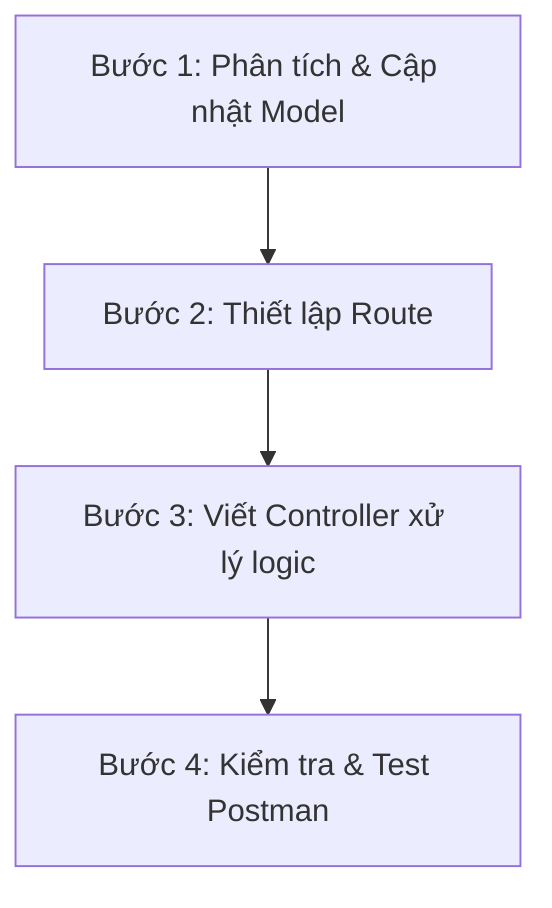

# HƯỚNG DẪN ÔN TẬP PE NODE.JS & THỰC HÀNH THÊM API HUỶ SẠC (CANCEL)
python pe_generator.py

Tài liệu này tổng hợp phân tích điểm chung của các dự án PE (Practical Exam), bài học kinh nghiệm, quy trình thêm API mới và hướng dẫn chi tiết cách viết & test API Huỷ sạc pin (`cancel`) theo đúng yêu cầu thực tế.

---

## 1. Điểm Chung Của Các Dự Án PE NodeJS
Qua phân tích các dự án:
- [coworkingBooking](file:///d:/Assignment_NodeJS/coworkingBooking)
- [movieBooking](file:///d:/Assignment_NodeJS/movieBooking)
- [EVChargingSystem](file:///d:/Assignment_NodeJS/EVChargingSystem)
- [carRental](file:///d:/Assignment_NodeJS/carRental)

Chúng ta có thể thấy cấu trúc và mô hình chung rất đồng nhất:

1. **Cấu trúc thư mục chuẩn MVC (Model-View-Controller)**:
   - `config/`: Kết nối cơ sở dữ liệu MongoDB thông qua Mongoose (ví dụ: [db.js](file:///d:/Assignment_NodeJS/EVChargingSystem/config/db.js)).
   - `models/`: Định nghĩa các Schema của Mongoose (thường có `User`, thực thể cần đặt thuê như `Station`/`Car`/`Space`/`Showtime`, và thực thể ghi nhận giao dịch như `Session`/`Rental`/`Reservation`/`Booking`).
   - `controllers/`: Chứa toàn bộ logic xử lý nghiệp vụ, kiểm tra hợp lệ đầu vào, tính toán giá tiền, cập nhật ví.
   - `routes/`: Định tuyến các endpoint HTTP và tích hợp middlewares kiểm tra quyền truy cập.
   - `middlewares/`: Kiểm tra JWT Token (`authMiddleware`) và phân quyền người dùng (`roleMiddleware` như `admin`, `customer`).
   - `server.js`: File khởi tạo Express app, cấu hình cổng port, đăng ký route, xử lý lỗi toàn cục.

2. **Nghiệp vụ cốt lõi (Core Business Logic)**:
   - **Xác thực & Phân quyền**: Đăng nhập trả về JWT, các request sau gửi kèm JWT ở header `Authorization: Bearer <token>`.
   - **Đặt lịch không trùng (Overlap Booking Check)**: Luôn có logic kiểm tra khoảng thời gian yêu cầu sạc/thuê/đặt chỗ xem có bị trùng với khoảng thời gian đã được đặt trước đó không.
     - *Công thức vàng check trùng*: `startTime < existingEndTime AND endTime > existingStartTime`.
   - **Thanh toán qua ví điện tử (Wallet Balance)**: Người dùng có thuộc tính `balance`. Khi đặt dịch vụ, kiểm tra số dư (`balance >= totalCost`). Nếu đủ thì trừ tiền của User trước khi tạo hóa đơn thành công.

---

## 2. Bài Học Rút Ra Để Vượt Qua Kỳ Thi PE

> [!IMPORTANT]
> Đây là những điểm cực kỳ quan trọng giúp tránh bị trừ điểm hoặc lỗi hệ thống khi chấm bài.

* **Tránh lỗi sai lệch thời gian (Timezone / Date validation)**:
  - Khi so sánh thời gian, luôn tạo đối tượng `new Date(timeString)` và sử dụng `.getTime()` để so sánh bằng mili-giây.
  - Khi so sánh với thời điểm hiện tại `now = new Date()`, hãy cẩn thận với độ trễ giây. Đề bài thường yêu cầu thời gian bắt đầu phải lớn hơn hiện tại. Có thể trừ đi 1 phút hao hụt để test dễ dàng: `start.getTime() < now.getTime() - 60000`.
* **Độ chính xác số thực (Floating Point Safety)**:
  - Khi trừ tiền hoặc cộng tiền vào ví, luôn dùng `.toFixed(2)` và bọc lại bằng `Number()` để tránh lỗi hiển thị số thực dài (ví dụ: `28.899999999999995`).
  - Ví dụ: `user.balance = Number((user.balance - totalCost).toFixed(2));`.
* **Quản lý trạng thái (Status transition check)**:
  - Luôn kiểm tra trạng thái trước khi thực hiện hành động. Ví dụ: Chỉ cho phép hủy khi trạng thái là `pending` (không cho phép hủy khi đã `active`, `completed`, hoặc `cancelled`).
* **Kiểm tra quyền sở hữu (Ownership validation)**:
  - Khách hàng chỉ được phép tương tác với dữ liệu của chính mình: `session.userId.toString() === req.user._id.toString()`.

---

## 3. Quy Trình 4 Bước Khi Thêm Một API Mới

Nếu giáo viên yêu cầu viết thêm một API (ví dụ: `cancel`, `extend`, `refund`, v.v.), hãy làm theo các bước sau:



### Bước 1: Phân tích nghiệp vụ & Cập nhật Model (nếu cần)
- API này tác động lên thực thể nào? (Ví dụ: `Session`).
- Thực thể đó có cần lưu thêm thuộc tính gì mới không? (Ví dụ: `refundAmount`, `cancelledAt`). Nếu có, hãy cập nhật Schema trong [sessionModel.js](file:///d:/Assignment_NodeJS/EVChargingSystem/models/sessionModel.js).

### Bước 2: Thiết lập Route
- Mở file router tương ứng (ví dụ: [sessionRoutes.js](file:///d:/Assignment_NodeJS/EVChargingSystem/routes/sessionRoutes.js)).
- Chọn phương thức HTTP phù hợp:
  - `POST` hoặc `PUT` hoặc `PATCH` cho các hành động thay đổi trạng thái/dữ liệu. (Thường là `PUT` hoặc `POST` cho thao tác Huỷ).
- Đặt endpoint rõ ràng: `/sessions/:id/cancel` hoặc `/sessions/cancel/:id`.
- Tích hợp Middleware bảo vệ: `protect` (hoặc `authMiddleware`) để xác định ai đang gọi API.

### Bước 3: Viết logic xử lý trong Controller
- Định nghĩa hàm xử lý trong controller (ví dụ: `cancelSession` trong [sessionController.js](file:///d:/Assignment_NodeJS/EVChargingSystem/controllers/sessionController.js)).
- Tiến hành tuần tự các bước kiểm tra (Xem chi tiết mục 4).

### Bước 4: Test thử nghiệm và viết tài liệu
- Chạy server và dùng Postman/Curl để test các trường hợp biên (boundary cases).

---

## 4. Hướng Dẫn Thực Hành: API Huỷ Sạc Pin (`cancel`)

Dưới đây là mã nguồn mẫu chi tiết cách triển khai nghiệp vụ Huỷ sạc pin trong [sessionController.js](file:///d:/Assignment_NodeJS/EVChargingSystem/controllers/sessionController.js):

```javascript
const cancelSession = async (req, res) => {
  try {
    // 1. Tìm Session theo ID truyền từ URL params
    const session = await Session.findById(req.params.id);

    if (!session) {
      return res.status(404).json({
        message: "Không tìm thấy phiên sạc này!"
      });
    }

    // 2. Xác thực quyền sở hữu (Chỉ tài khoản đặt mới được huỷ)
    if (session.userId.toString() !== req.user._id.toString()) {
      return res.status(403).json({
        message: "Bạn không có quyền huỷ phiên sạc của người khác!"
      });
    }

    // 3. Kiểm tra trạng thái: Chỉ được huỷ khi trạng thái là 'pending'
    if (session.status !== "pending") {
      return res.status(400).json({
        message: `Không thể huỷ phiên sạc có trạng thái "${session.status}". Chỉ cho phép huỷ phiên sạc đang 'pending'.`
      });
    }

    const now = new Date();
    const start = new Date(session.startTime);

    // 4. Kiểm tra xem đã đến giờ hoặc quá giờ sạc chưa
    if (start.getTime() <= now.getTime()) {
      return res.status(400).json({
        message: "Không thể huỷ phiên sạc đã tới giờ hoặc đã qua giờ bắt đầu!"
      });
    }

    // 5. Tính toán khoảng thời gian từ hiện tại tới lúc bắt đầu sạc (đơn vị: giờ)
    const diffMs = start.getTime() - now.getTime();
    const diffHours = diffMs / (1000 * 60 * 60);

    let refundPercentage;
    if (diffHours >= 2) {
      refundPercentage = 1.0; // Hoàn 100% nếu huỷ trước trên 2 tiếng
    } else {
      refundPercentage = 0.7; // Hoàn 70% nếu huỷ trước dưới 2 tiếng
    }

    const refundAmount = Number((session.totalCost * refundPercentage).toFixed(2));

    // 6. Hoàn tiền vào ví điện tử của User
    const user = await User.findById(req.user._id);
    user.balance = Number((user.balance + refundAmount).toFixed(2));
    await user.save();

    // 7. Cập nhật trạng thái và thông tin huỷ của Session
    session.status = "cancelled";
    session.refundAmount = refundAmount;
    session.cancelledAt = now;
    await session.save();

    // 8. Trả kết quả về cho client
    res.status(200).json({
      message: "Huỷ phiên sạc thành công!",
      session: {
        _id: session._id,
        status: session.status,
        totalCost: session.totalCost,
        refundPercentage: `${refundPercentage * 100}%`,
        refundAmount: session.refundAmount,
        remainingBalance: user.balance
      }
    });
  } catch (error) {
    res.status(500).json({
      message: "Có lỗi xảy ra khi huỷ phiên sạc",
      error: error.message
    });
  }
};
```

---

## 5. Hướng Dẫn Test Chi Tiết 3 Trường Hợp Cho Cô Giáo

Khi chấm bài thi, giáo viên sẽ muốn kiểm tra tính đúng đắn của logic thời gian. Ta cần tạo các kịch bản test có thời gian bắt đầu (`startTime`) tương ứng.

> [!TIP]
> Do thời gian thực tế luôn chạy trôi đi, cách tốt nhất là **dùng Postman để BOOK 3 Session mới** với các mốc thời gian linh hoạt tính từ thời điểm hiện tại của bạn.

### Chuẩn bị dữ liệu ban đầu
1. Đăng nhập tài khoản Customer để lấy JWT Token. Điền Token vào tab `Authorization` -> `Bearer Token` trong Postman.
2. Kiểm tra số dư ví ban đầu (ví dụ: `balance = 500`).
3. Lấy một `stationId` khả dụng.

---

### KỊCH BẢN TEST 1: Đã tới giờ hoặc quá giờ (Không cho phép hủy)

**Mục tiêu**: Chứng minh rằng nếu phiên sạc đã/đang diễn ra, hệ thống sẽ chặn không cho huỷ.

1. **Bước 1**: Đặt (Book) 1 Session với `startTime` rất gần hiện tại (hoặc đợi cho tới khi giờ đặt sạc trôi qua thời điểm hiện tại).
   * Ví dụ: Hiện tại là `09:20`. Book sạc từ `09:15` đến `10:15` (hoặc đặt sạc `09:21` đến `10:21` rồi đợi qua `09:21`).
2. **Bước 2**: Gọi API Huỷ sạc:
   * **Method**: `PUT` hoặc `POST` (Tùy theo cấu hình route)
   * **URL**: `http://localhost:9999/api/sessions/<SESSION_ID_1>/cancel`
3. **Kết quả mong đợi (Expected Response)**:
   * **HTTP Status**: `400 Bad Request`
   * **JSON Body**:
     ```json
     {
       "message": "Không thể huỷ phiên sạc đã tới giờ hoặc đã qua giờ bắt đầu!"
     }
     ```

---

### KỊCH BẢN TEST 2: Huỷ trước trên 2 tiếng (Hoàn tiền 100%)

**Mục tiêu**: Chứng minh nếu huỷ trước giờ sạc $\ge 2$ tiếng, khách hàng nhận lại toàn bộ tiền.

1. **Bước 1**: Đặt (Book) 1 Session mới với `startTime` cách hiện tại trên 2 giờ.
   * Ví dụ: Hiện tại là `09:20`. Book sạc từ `12:00` đến `13:00` cùng ngày (khoảng cách là 2 tiếng 40 phút > 2 tiếng).
   * Giả sử chi phí của phiên sạc này là `100.00`. Sau khi đặt, ví của bạn bị trừ đi `100.00`.
2. **Bước 2**: Gọi API Huỷ sạc ngay lập tức:
   * **Method**: `PUT` / `POST`
   * **URL**: `http://localhost:9999/api/sessions/<SESSION_ID_2>/cancel`
3. **Kết quả mong đợi (Expected Response)**:
   * **HTTP Status**: `200 OK`
   * **JSON Body**:
     ```json
     {
       "message": "Huỷ phiên sạc thành công!",
       "session": {
         "status": "cancelled",
         "totalCost": 100,
         "refundPercentage": "100%",
         "refundAmount": 100,
         "remainingBalance": 500 // Số dư ví được hoàn đủ 100
       }
     }
     ```

---

### KỊCH BẢN TEST 3: Huỷ trước dưới 2 tiếng (Hoàn tiền 70%)

**Mục tiêu**: Chứng minh nếu huỷ trước giờ sạc $< 2$ tiếng, khách hàng chỉ nhận lại 70% tiền, bị phạt 30%.

1. **Bước 1**: Đặt (Book) 1 Session mới với `startTime` cách hiện tại ít hơn 2 giờ (nhưng phải lớn hơn hiện tại để chưa bắt đầu).
   * Ví dụ: Hiện tại là `09:20`. Book sạc từ `10:30` đến `11:30` cùng ngày (khoảng cách là 1 tiếng 10 phút < 2 tiếng).
   * Giả sử chi phí của phiên sạc này là `100.00`. Sau khi đặt, ví bị trừ đi `100.00`.
2. **Bước 2**: Gọi API Huỷ sạc ngay lập tức:
   * **Method**: `PUT` / `POST`
   * **URL**: `http://localhost:9999/api/sessions/<SESSION_ID_3>/cancel`
3. **Kết quả mong đợi (Expected Response)**:
   * **HTTP Status**: `200 OK`
   * **JSON Body**:
     ```json
     {
       "message": "Huỷ phiên sạc thành công!",
       "session": {
         "status": "cancelled",
         "totalCost": 100,
         "refundPercentage": "70%",
         "refundAmount": 70, // Bị phạt 30, chỉ hoàn 70
         "remainingBalance": 470 // Ví chỉ được cộng lại 70
       }
     }
     ```
